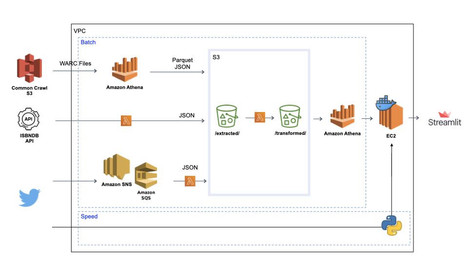

# Introduction

## Twitterbooks: Current Book Trends on Twitter

This is a project that emerged from my research at Washington University in St. Louis, as well as the Data Engineering Nanodegree program at Udacity. The goal is to capture book trends on Twitter by tracking recent mentions of books.

In this project, I built a pipeline to compile a list of books from petabytes of data in Common Crawl, together with metadata from ISBNDB.com. Recent mentions of books are tracked and stored in the cloud to be made available weekly on http://twitterbooks.io/. The results can be used to discover new books or to observe patterns in literary reception.
 
 
# Pipeline

I built a data pipeline to comple a list of books from Common Crawl, gather metadata from ISBNDB, and track mentions on Twitter.

1. AWS Athena to query WARC files and parse Amazon book URLS for ISBNs
2. AWS Lambda to query ISBNDB with ISBNs
    - store response (book metadata) in S3 
    - publish twitter queries to SNS topic
3. AWS Lambda to req twitter api, store results in S3
4. AWS Lambda to clean, filter, and aggregate twitter mentions and book metadata, store results in S3
5. AWS Glue to read fact table json and create/update table in Athena
6. Dockerized app on EC2 instance to query twitter api to update the counts and display data with Streamlit
 
 

# Architecture
1. The project employs lambda architecture principles by having a batch layer and a speed layer.
2. The batch layer is scheduled to run once a week. 
    - Given Twitter's rate limits, it takes roughly one day to query 7-day counts for ~170,000 books.  
3. The speed layer updates the data for the top 100 books when the user opens the web app.
4. ETL:
    - Extracted data is stored in S3 as json files.
    - The files are transformed and stored in a different directory.
    - Glue Crawler reads the fact table file and creates/updates the table in the Athena database
5. The project minimizes cost by
    - using AWS lambda functions to pay for compute
    - using data lake and schema-on-read
 
 

# Setup

[Working on infrastructure-as-code]

AWS

1. S3 bucket; in this case s3://warcbooks
2. Athena: follow the instructions provided [here](https://commoncrawl.org/2018/03/index-to-warc-files-and-urls-in-columnar-format/)
3. Lambda functions "twitterbooks", "query_bookset_prepbatch_books", and "main_batch_topbooks"; add lib.py, the AWSWrangler layer and, if need be, the up-to-date boto3 layer following the instructions provided [here](https://aws.amazon.com/premiumsupport/knowledge-center/lambda-python-runtime-errors/)
4. SNS topics 'prepbatch.fifo' and 'batchbook.fifo'; SQS queues with the same names; configure deadletter.fifo queue
5. AWS Eventbridge to schedule prepbatch.fifo and batchbook.fifo to run once a week, one day apart (prepbatch first)
6. EC2 instance (t2.micro) with inbound rules for port 8501 from anywhere, place your aws credential and config files in ~/.aws (instructions [here](https://docs.aws.amazon.com/cli/latest/userguide/cli-configure-files.html))
7. Set up IAM roles and permissions as required

Front End

8. Write your twitter api bearer token in ./.streamlit/secrets.toml as "t_bearer_token" 
9. Install Docker on EC2, build image with Docker file, run image

## Languages
- Python 3.8

## Technologies
- AWS Glue, Eventbridge, Athena, Lambda, SNS, SQS, EC2
- Docker
- Streamlit
 
 

# Repository Structure
The working directory contains the app (hello.py), Dockerfile, and requirements.txt.

./Lambda/ contains the lambda functions and lib.py
 
 

# Notes on Methodology
- The project focuses on recent data and automated tracking of recent trends. Since twitter already provides full search capabilities to academics, such funcationality did not need to be replicated.
- To efficiently navigate Twitter's API limits, books are queried in chunks of ~10 books. Batches with 0 mentions are discarded. Only the top batches are exploded into individual book queries.
- Since old books can resurface for whatever reason, it's important to track a large set of books rather than closely following a small, subjectively-curated list.
- Due to Twitter's API limits, it's not possible to query the millions of books that are out there on a regular basis. Common Crawl and Amazon book urls are used to narrow the list to the hundreds of thousands.
- Books are always given the publication year of their earliest edition so that the stats based on publication years are meaningful.
- Author names and shortened titles are used to build queries. Tweets that aren't about books may be counted, despite extensive filtering. Using author names should reduce false positives to a large extent, especially in conjunction with the title. Because of this filtering logic, books authored by public figure are manually excluded. FYI, Twitter's context annotations, at least in the book genre, are not very accurate.
- Alternative approach: Poll every tweet through twitter's volume stream api introduced in v2, process it through spark streaming + NLP libraries to better determine a book tweet as such.